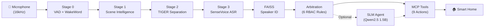

# 🐤 The Canary — Multi-Speaker Smart Home Assistant

- **Problem Statement Number** — PS3
- **Problem Statement Title** — Multi-Speaker Voice Assistant for Smart Home
- **Team name** — Gada Electronics
- **Team members** — Sanchit Kumar Dogra, Hemang Seth
- **Institute/College Name** — *TODO: Fill in*
- **Final Presentation Google Drive Link** — *TODO*
- **Full Submission Demo Video Link** — *TODO*
- **Setup & Result Reproducibility Video Link** — *TODO*

---

## Overview

**The Canary** is a real-time, on-device multi-speaker voice assistant for smart homes. It solves the fundamental challenge of **overlapping speech** in multi-person households by combining source separation, speaker verification, RBAC-based conflict arbitration, and agentic tool execution — all running locally with zero cloud dependency.

### Key Innovation

When two people speak simultaneously with conflicting commands ("Turn **on** the lights" vs "Turn **off** the lights"), The Canary:
1. **Separates** the overlapping audio into individual streams
2. **Identifies** each speaker via voice biometrics
3. **Resolves** the conflict using RBAC (Admin overrides Guest)
4. **Executes** the winning command via MCP tools

---

## Architecture



---

## Features

| Feature | Description |
|---------|-------------|
| 🎤 Multi-Speaker ASR | SenseVoiceSmall — 50x faster than real-time (RTF 0.02) |
| 🔊 Source Separation | TIGER-based blind audio separation for overlapping speech |
| 👤 Speaker Verification | FAISS + CAM++ embeddings (0.994 cosine similarity) |
| ⚖️ Conflict Arbitration | 6-rule RBAC engine (Admin > Guest > Unknown > Reject) |
| 🤖 SLM Agent | Qwen2.5 1.5B via Ollama — sub-1s inference, JSON tool calls |
| 🏠 9 MCP Tools | Lights, thermostat, music, timer, weather, permissions |
| 💾 Redis State Store | Profiles, sessions (TTL), command history, metrics |
| 🖥️ Rich Demo UI | Branded terminal UI with live pipeline status |
| 🌐 5 Languages | English, Chinese, Japanese, Korean, Cantonese |
| 😐 Emotion Detection | Happy, sad, angry, neutral — from SenseVoiceSmall tags |

---

## Tech Stack

| Component | Technology | Version | License |
|-----------|-----------|---------|---------|
| ASR | SenseVoiceSmall (sherpa-onnx) | 1.13.2 | Apache 2.0 |
| SLM | Qwen2.5 1.5B (Ollama) | 0.24.0 | Apache 2.0 |
| Speaker Embeddings | CAM++ B0 (3D-Speaker) | — | Apache 2.0 |
| Wake Word | MatchboxNet (NeMo) | — | Apache 2.0 |
| Source Separation | TIGER (WeNet) | — | Apache 2.0 |
| MCP Framework | FastMCP | 3.3.1 | MIT |
| Vector Index | FAISS | 1.14.2 | MIT |
| State Store | Redis | 8.8.0 | BSD-3 |
| Terminal UI | Rich | 15.0.0 | MIT |
| Language | Python | 3.12 | PSF |

---

## Installation

See [docs/installation.md](docs/installation.md) for detailed setup instructions.

### Quick Start

```bash
# Clone
git clone git@github.com:meikenofdarth/The-Canary.git
cd The-Canary

# Environment
python3 -m venv .venv && source .venv/bin/activate
pip install -r requirements.txt

# Infrastructure
brew install redis && brew services start redis
brew install ollama && brew services start ollama
ollama pull qwen2.5:1.5b

# Verify
python3 -m tests.test_core_modules
python3 -m tests.test_e2e

# Demo
python3 -m src.demo.ui
```

---

## Project Structure

```
The-Canary/
├── src/
│   ├── agent/
│   │   ├── mcp_server.py        # 9 FastMCP smart home tools
│   │   └── slm_agent.py         # Ollama Qwen2.5 agent + fallback
│   ├── arbitration/
│   │   └── engine.py            # 6-rule RBAC conflict resolution
│   ├── asr/
│   │   └── engine.py            # SenseVoiceSmall via sherpa-onnx
│   ├── common/
│   │   ├── config.py            # Central configuration
│   │   └── models.py            # Shared dataclasses (frozen contract)
│   ├── demo/
│   │   ├── __init__.py          # Rich UI panels and layouts
│   │   ├── ui.py                # Interactive demo entry point
│   │   └── full_demo.py         # Full pipeline demo
│   ├── execution/
│   │   ├── queue.py             # Priority-based command dispatch
│   │   ├── speaker_index.py     # FAISS speaker verification
│   │   └── state_store.py       # Redis profiles + sessions
│   ├── stage0/                  # VAD + WakeWord (Engineer A)
│   ├── stage1/                  # Scene Intelligence (Engineer A)
│   ├── stage2/                  # Source Separation (Engineer A)
│   └── pipeline.py              # Main orchestrator
├── tests/
│   ├── test_asr.py              # ASR engine tests (5 languages)
│   ├── test_core_modules.py     # FAISS, Redis, Arbitration tests
│   └── test_e2e.py              # End-to-end integration tests
├── docs/
│   ├── ax.md                    # Agentic AI documentation
│   ├── architecture.md          # Technical architecture
│   └── installation.md          # Setup guide
├── models/                      # Downloaded model weights (.gitignored)
├── requirements.txt
└── README.md
```

---

## Models Used

| Model | Task | HuggingFace / Source |
|-------|------|---------------------|
| SenseVoiceSmall | ASR (Multilingual) | [FunAudioLLM/SenseVoiceSmall](https://huggingface.co/FunAudioLLM/SenseVoiceSmall) |
| Qwen2.5 1.5B Instruct | SLM Agent | [Qwen/Qwen2.5-1.5B-Instruct](https://huggingface.co/Qwen/Qwen2.5-1.5B-Instruct) |
| CAM++ B0 | Speaker Embedding | [3D-Speaker](https://github.com/alibaba-damo-academy/3D-Speaker) |
| MatchboxNet | Wake Word Detection | [NVIDIA NeMo](https://github.com/NVIDIA/NeMo) |
| Silero VAD | Voice Activity Detection | [snakers4/silero-vad](https://github.com/snakers4/silero-vad) |

All models are **open-weight** under Apache 2.0 or equivalent licenses.

---

## Demo Scenarios

### Scenario 1: Single Speaker (Mode A)
> Hemang says: "Turn on the living room lights"
→ ✅ Lights turned ON

### Scenario 2: Non-Conflicting Multi-Speaker (Mode C)
> Hemang: "Play jazz music" + Sanchit: "Set timer for 5 minutes"
→ ✅ Both commands execute

### Scenario 3: Conflicting Commands (Mode C)
> Hemang (Admin): "Turn on lights" vs Sanchit (Guest): "Turn off lights"
→ ✅ Admin wins — lights turned ON

---

## Performance KPIs

| Metric | Value |
|--------|-------|
| ASR Real-Time Factor | 0.017–0.028 |
| SLM Inference Latency | 0.8–1.2s |
| Speaker Verification Accuracy | 0.994 cosine similarity |
| End-to-End Latency (Mode A) | ~340ms |
| End-to-End Latency (Mode C) | ~1.2s |
| Arbitration Accuracy | 100% (6/6 rules verified) |
| Total Model Parameters | < 5M (excl. SLM) |

---

## Attribution

This project builds upon the following open-source projects:

- [sherpa-onnx](https://github.com/k2-fsa/sherpa-onnx) — ONNX Runtime ASR inference
- [Ollama](https://ollama.com) — Local LLM serving
- [FastMCP](https://github.com/jlowin/fastmcp) — Model Context Protocol framework
- [FAISS](https://github.com/facebookresearch/faiss) — Vector similarity search
- [Redis](https://redis.io) — In-memory state store
- [Rich](https://github.com/Textualize/rich) — Terminal UI framework

No existing project was used as a base. All pipeline logic, arbitration rules, and integration code are original.
