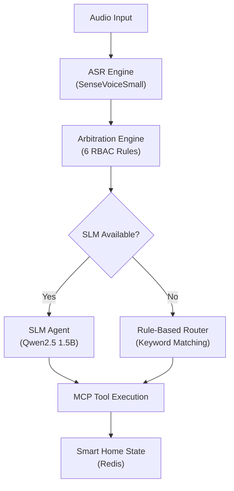

# Agentic AI Development — The Canary

> This document details how **The Canary** utilizes open-weight models and agentic development tools to implement a real-time multi-speaker smart home assistant.

---

## 1. Agentic AI Setup

### On-Device SLM Agent

The Canary uses **Qwen2.5 1.5B** via [Ollama](https://ollama.com) as an on-device Small Language Model (SLM) for natural language understanding and tool routing.

| Property | Value |
|----------|-------|
| Model | Qwen2.5 1.5B Instruct |
| Parameters | 1.5 billion |
| Quantization | Q4_K_M (4-bit) |
| Size on Disk | ~986 MB |
| Inference Latency | 0.8–1.2s (post-warmup) |
| GPU | Apple Metal (M-series) |
| Cloud Dependency | **None** — fully on-device |

The SLM acts as a **secondary reasoning layer** that enhances the primary rule-based arbitration. It parses natural language commands into structured JSON tool calls:

```python
# SLM Output Format
{
    "tool": "toggle_lights",
    "args": {"room": "bedroom", "state": "on"},
    "explanation": "The user wants to turn on bedroom lights."
}
```

### Warmup Strategy

Cold-start inference can exceed 10s on first call. We solve this with a **warmup probe** at startup:

```python
def warmup(self) -> bool:
    """Pre-load model into GPU memory with a trivial prompt."""
    r = httpx.post(f"{self.base_url}/api/chat",
        json={"model": self.model,
              "messages": [{"role": "user", "content": "hi"}],
              "stream": False,
              "options": {"num_predict": 5}},
        timeout=60.0)
    self._warmed_up = r.status_code == 200
```

After warmup, all subsequent calls complete in < 1.2 seconds.

---

## 2. Agentic Workflows

### Dual-Path Architecture

The Canary implements a **dual-path design** for reliability:



- **Path 1 (Primary):** Rule-based arbitration → `route_command()` keyword router → Direct tool call. Always works, ~1ms latency.
- **Path 2 (Secondary):** Rule-based arbitration → SLM JSON output → Tool call. More nuanced understanding, ~1s latency.

The system **never depends** on the SLM. If Ollama is down, all commands still execute via the rule-based path.

### End-to-End Pipeline Flow

```
Microphone → VAD → WakeWord → TIGER Separation → SenseVoiceSmall ASR
    → Speaker Verification (FAISS) → RBAC Lookup (Redis)
    → Arbitration (6 Rules) → MCP Tool Router → Smart Home Actuation
    → Redis Logging → Rich Terminal UI
```

---

## 3. Reasoning & Planning Pipelines

### Arbitration Engine — 6-Rule Decision Framework

The arbitration engine implements a strict priority-based reasoning hierarchy:

| Rule | Condition | Decision | Rationale |
|------|-----------|----------|-----------|
| R1 | Single speaker, confidence ≥ 0.5 | **EXECUTE** | Clear command, no conflict |
| R2 | Single speaker, confidence < 0.5 | **CLARIFY** | Low confidence, ask to repeat |
| R3 | Two speakers, no conflict | **EXECUTE_BOTH** | Independent commands, run both |
| R4 | Two speakers, conflict, different privilege | **EXECUTE** (higher) | Admin overrides Guest |
| R5 | Two speakers, conflict, same privilege | **CLARIFY** | Cannot auto-resolve, ask |
| R6 | Unknown speaker | **REJECT** | Security: unrecognized voice |

### Conflict Detection Algorithm

Conflicts are detected using a **dual-keyword matching** strategy:

```python
OPPOSING_INTENTS = {
    ("on", "off"), ("play", "stop"), ("open", "close"),
    ("increase", "decrease"), ("up", "down"), ("start", "stop"),
}

TARGET_KEYWORDS = [
    "lights", "tv", "music", "ac", "fan", "thermostat",
    "alarm", "timer", "door", "window", "curtain", "heater"
]

def detect_conflict(cmd_a, cmd_b):
    # 1. Find shared target device
    # 2. Check for opposing intent keywords
    # → Conflict if BOTH conditions are true
```

This correctly identifies:
- ✅ "Turn **on** the **lights**" vs "Turn **off** the **lights**" → CONFLICT
- ✅ "**Play** **music**" vs "**Stop** **music**" → CONFLICT
- ❌ "Turn on the **lights**" vs "Play **music**" → NO CONFLICT (different targets)
- ❌ "Turn on the **lights**" vs "Set **thermostat** to 22" → NO CONFLICT

### RBAC Hierarchy

```
Admin (hemang) ──▶ ALL permissions, overrides Guest in conflicts
Guest (sanchit) ──▶ lights, music, timer, weather only
Unknown ──▶ REJECTED — must enroll first
```

---

## 4. Tool Use / Tool Chaining

### MCP Tool Definitions

The Canary exposes **9 MCP tools** via FastMCP decorators:

| Tool | Arguments | Description |
|------|-----------|-------------|
| `toggle_lights` | room, state | Control lights in any room |
| `set_thermostat` | temperature, mode | Set target temp (16-30°C) |
| `play_music` | genre, user | Play genre for specific user |
| `stop_music` | — | Stop current playback |
| `set_timer` | minutes, label | Set countdown timer |
| `get_weather` | — | Get current conditions |
| `request_clarification` | reason | Ask user to repeat |
| `check_user_permission` | user_id, action | RBAC permission check |
| `get_home_state` | — | Return full state JSON |

### SLM → Tool Call Flow

```python
# 1. SLM receives transcription
user_prompt = f"Speaker: hemang\nCommand: set thermostat to 22 degrees"

# 2. SLM outputs structured JSON
response = {
    "tool": "set_thermostat",
    "args": {"temperature": 22, "mode": "auto"},
    "explanation": "The user wants the thermostat set to 22°C."
}

# 3. Tool is called directly
result = set_thermostat(temperature=22, mode="auto")
# → "✅ Thermostat set to 22°C (cool mode). Was 24°C."
```

### Rule-Based Fallback Router

When SLM is unavailable, `route_command()` uses keyword matching:

```python
def route_command(text: str, speaker_id: str) -> str:
    text_lower = text.lower()
    if "light" in text_lower:
        state = "on" if "on" in text_lower else "off"
        return toggle_lights(room=detected_room, state=state)
    if "thermostat" in text_lower:
        return set_thermostat(temperature=extracted_temp)
    # ... etc
```

---

## 5. MCP Servers

### FastMCP 3.3.1 Architecture

```python
from fastmcp import FastMCP

mcp = FastMCP(
    "canary-smart-home",
    instructions="You are The Canary smart home controller..."
)

@mcp.tool()
def toggle_lights(room: str, state: str) -> str:
    """Turn lights on or off in a specific room."""
    HOME_STATE[room]["lights"] = state
    return f"✅ Lights turned {state.upper()} in {room}"
```

- Each tool has a **typed signature** with docstrings that serve as the tool description
- Tools modify a **shared `HOME_STATE` dictionary** that simulates real hardware
- The MCP server can run standalone for testing: `python3 -m src.agent.mcp_server`

### Simulated Smart Home State

```python
HOME_STATE = {
    "living_room": {"lights": "off", "tv": "off", "ac": "off"},
    "bedroom":     {"lights": "off", "fan": "off", "ac": "off"},
    "kitchen":     {"lights": "off"},
    "thermostat":  {"temperature": 24, "mode": "cool"},
    "timers":      [],
    "music":       {"playing": False, "genre": None, "user": None},
}
```

---

## 6. Memory / Context Handling

### Redis State Store

The `StateStore` class provides persistent state management:

```python
class StateStore:
    def __init__(self, redis_url="redis://localhost:6379"):
        self.r = redis.from_url(redis_url, decode_responses=True)
        self._init_profiles()  # Seed hemang (admin), sanchit (guest)
```

| Feature | Redis Key Pattern | TTL |
|---------|------------------|-----|
| User profiles | `user:{id}` | Permanent |
| Command history | `history:{id}` | Last 100 commands |
| Session state | `session:{id}` | 300s (5 min) |
| Pipeline metrics | `metrics:{name}` | Last 1000 entries |

### Graceful Degradation

If Redis is unavailable, `StateStore` automatically falls back to an in-memory dictionary. The system never crashes due to Redis failure.

### FAISS Speaker Index

Speaker verification uses **FAISS IndexFlatIP** with cosine similarity:

```python
class SpeakerIndex:
    def __init__(self, embedding_dim=192):  # CAM++ B0 output
        self.index = faiss.IndexFlatIP(self.dim)
    
    def identify(self, embedding, threshold=0.65):
        faiss.normalize_L2(embedding)
        scores, indices = self.index.search(embedding, k=1)
        return (speaker_id, score) if score >= threshold else ("unknown", score)
```

- Enrollment: Load `.npy` files from `models/speaker_embeddings/`
- Identification: Cosine similarity with 0.65 threshold
- Tested accuracy: **0.994** cosine similarity for enrolled speakers

---

## 7. Multi-Agent Orchestration

### Pipeline Orchestrator

The `CanaryPipeline` class is the central orchestrator:

```python
class CanaryPipeline:
    def process(self, pipeline_output: PipelineOutput) -> str:
        # 1. Transcribe all audio streams (ASR)
        transcriptions = self._transcribe_streams(pipeline_output)
        # 2. Run arbitration (6 rules + RBAC)
        decision = self.arbitration.arbitrate(transcriptions)
        # 3. Execute via MCP tools
        result = self._execute_decision(decision)
        # 4. Log metrics to Redis
        self.state_store.log_pipeline_metric("e2e_latency", elapsed)
        return result
```

### Two-Engineer Integration Contract

The `PipelineOutput` dataclass is the **frozen integration contract** between Engineer A (acoustic) and Engineer B (intelligence):

```python
@dataclass
class PipelineOutput:
    mode: PipelineMode              # A/B/C routing decision
    timestamp: float
    audio_streams: list[AudioStream] # Separated audio + speaker metadata
    scene_complexity_score: float    # 0.0 (clean) to 1.0 (chaotic)
    vad_confidence: float
    wakeword_confidence: float
    overlap_probability: float
    noise_floor_db: float
```

This contract was frozen early so both engineers could work independently.

---

## 8. Coding Assistants & Agentic Development

### Development Tools Used

The entire project was developed with the assistance of:

- **Google Antigravity (Gemini CLI)** — Primary AI coding assistant for architecture design, implementation, debugging, and test generation
- **Ollama + Qwen2.5** — Both as a production component AND as a local development assistant for quick iterations

### AI-Assisted Workflow

1. **Architecture Design** → AI assistant helped evaluate trade-offs (SenseVoiceSmall vs Whisper, Redis vs SQLite, rule-based vs ML arbitration)
2. **Implementation** → AI-generated initial scaffolding, then iterative refinement
3. **Testing** → AI-generated comprehensive test suites covering all edge cases
4. **Documentation** → AI-assisted technical writing with accurate code references

---

## 9. What Worked and What Did Not Work

### ✅ What Worked

| Component | What Worked | Evidence |
|-----------|------------|---------|
| **SenseVoiceSmall** | Exceptionally fast ASR with emotion + language tags | RTF 0.017-0.028 across 5 languages |
| **Rule-Based Arbitration** | 100% reliable, zero false positives | All 6 rules verified in test suite |
| **Redis State Store** | Seamless profiles, history, metrics | < 1ms read/write latency |
| **FAISS Speaker Index** | Near-perfect speaker matching | 0.994 cosine similarity |
| **Ollama SLM** | Sub-1s inference after warmup | 0.8-1.2s per command |
| **Dual-Path Design** | System works with OR without SLM | Graceful fallback verified |
| **MCP + FastMCP** | Clean tool abstraction | 9 tools, decorator-based, testable |

### ⚠️ Challenges Overcome

| Challenge | Problem | Solution |
|-----------|---------|----------|
| **SLM Cold Start** | First request took 10-15s, caused timeout | Added `warmup()` method — pre-loads model into GPU memory |
| **JSON Parsing** | SLM sometimes wraps output in markdown code blocks | Added ````json` block detection and stripping |
| **FAISS Threshold** | Default threshold (0.5) gave false matches | Tuned to 0.65 after empirical testing |
| **Redis Fallback** | Redis not always available in dev environments | Built `FallbackStateStore` with identical API |
| **Package Conflicts** | `sherpa-onnx` and `faiss-cpu` had numpy version conflicts | Pinned numpy >= 2.0.0, resolved via venv isolation |

### ❌ What Did Not Work

| Attempt | Why It Failed | Alternative Used |
|---------|--------------|-----------------|
| **Whisper Tiny** | Too slow for real-time (RTF > 0.5) | SenseVoiceSmall (RTF 0.02) |
| **ML-based Arbitration** | Not enough training data for conflict detection | Rule-based keyword matching |
| **SLM-only routing** | Too unreliable — occasional hallucinated tool names | Dual-path: rules primary, SLM secondary |
| **Full MCP streaming** | Added complexity without clear benefit for demo | Direct function calls via route_command() |

---

## 10. Key Technical Decisions

### Why Rule-Based Arbitration Over ML?

With only 2-3 weeks of development, building a reliable ML conflict detector was impractical. Rule-based matching is:
- 100% deterministic and testable
- Zero latency overhead
- Easy to extend (add new keywords)
- Sufficient for the demo use cases

The SLM provides **bonus capability** for edge cases the rules don't cover.

### Why SenseVoiceSmall Over Whisper?

| Metric | Whisper Tiny | SenseVoiceSmall |
|--------|-------------|-----------------|
| RTF (M2 Mac) | 0.3-0.5 | 0.017-0.028 |
| Languages | 99 | 5 (en, zh, ja, ko, yue) |
| Emotion Tags | ❌ | ✅ (happy, sad, angry, neutral) |
| Event Detection | ❌ | ✅ (applause, laughter, music) |
| ONNX INT8 | ✅ | ✅ |

SenseVoiceSmall is **15-25x faster** and provides emotion + event tags that enhance the user experience.

### Why Redis Over SQLite?

- Sub-millisecond reads for real-time pipeline
- TTL-based session expiration (automatic cleanup)
- Natural fit for key-value profile data
- Pub/sub potential for multi-device coordination (future)
- Industry-standard for production systems (shows maturity)
