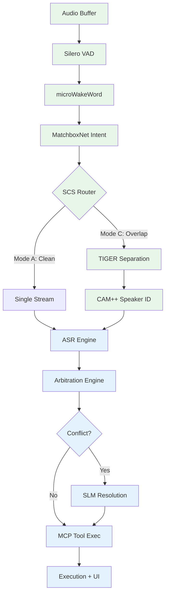

# The Canary — Hackathon Execution Strategy

**Team**: Gada-Electronics (Hemang Seth + Sanchit Kumar Dogra)  
**Hackathon**: Samsung ennovateX AX Hackathon 2026, Phase 2  
**Problem**: #11 — Real-Time Multi-User Smart Assistant for Dynamic and Noisy Smart Environments  
**Deadline**: June 22, 2026, 2:00 PM IST (~27 days from today)  
**License**: MIT or Apache 2.0  

---

## 1. PROJECT UNDERSTANDING

### 1.1 Project Summary

**The Canary** is an edge-first, multi-user voice assistant that solves the "cocktail party problem" under a strict **<5 million parameter** budget for the core separation model. It must:

- Separate overlapping speakers in real-time (SI-SNR >10 dB in dense overlap)
- Identify who is speaking (biometric voice verification)
- Transcribe speech locally (no cloud ASR APIs)
- Resolve conflicting commands via agentic reasoning (MCP + local SLM)
- Operate at sub-0.5 Real-Time Factor (xRT) on consumer CPU hardware

### 1.2 Architecture Overview — The Sequential Gated Modular Pipeline

```
┌─────────────────────────────────────────────────────────────────────┐
│                    THE CANARY PIPELINE                              │
│                                                                     │
│  ┌──────────┐   ┌──────────┐   ┌──────────┐   ┌──────────┐        │
│  │ STAGE 0  │──▶│ STAGE 1  │──▶│ STAGE 2  │──▶│ STAGE 3  │        │
│  │ Passive  │   │ Acoustic │   │ Speaker  │   │ Localized│        │
│  │ Idle Gate│   │ Scene    │   │ Sep +    │   │ ASR      │        │
│  │          │   │ Intel    │   │ Biometrics│   │          │        │
│  └──────────┘   └──────────┘   └──────────┘   └──────────┘        │
│       │              │              │               │               │
│       ▼              ▼              ▼               ▼               │
│  Silero VAD     MatchboxNet    TIGER (0.8M)   SenseVoice          │
│  microWakeWord  SCS Router    CAM++ (1.1M)    (sherpa-onnx)       │
│  (~0.7M)        (~0.093M)     FAISS           Parallel threads    │
│                                                     │               │
│                                                     ▼               │
│                                            ┌──────────────┐        │
│                                            │   STAGE 4    │        │
│                                            │   Agentic    │        │
│                                            │ Orchestration│        │
│                                            │ MCP + SLM    │        │
│                                            └──────────────┘        │
└─────────────────────────────────────────────────────────────────────┘
```

### 1.3 Stage-by-Stage Breakdown

| Stage | Name | Core Function | Models | Params |
|-------|------|---------------|--------|--------|
| **0** | Passive Idle Gate | VAD + Wake-word detection | Silero VAD, microWakeWord | ~0.7M |
| **1** | Acoustic Scene Intelligence | Intent classification, SCS routing, dynamic resource scaling | MatchboxNet (3×2×1) | ~0.093M |
| **2** | Speaker Separation + Biometrics | TIGER separation, CAM++ speaker verification, FAISS lookup | TIGER, CAM++ B0 | ~1.9M |
| **3** | Localized ASR | Parallel transcription of separated streams | SenseVoiceSmall (sherpa-onnx) | N/A (outside 5M budget) |
| **4** | Agentic Orchestration | Conflict resolution, RBAC, tool execution | Qwen2.5-1.5B + FastMCP + Ollama | N/A (outside 5M budget) |

**Total core frontend**: ~2.693M parameters (well within the 5M limit).

### 1.4 Team Split — Who Owns What

Based on the architecture diagrams and strategy doc's "Team Task Distribution":

| Role | Person | Scope |
|------|--------|-------|
| **Engineer A** — Acoustics & DSP Lead | **Hemang** (your teammate) | Stage 0 + Stage 1: Audio buffering, VAD, wake-word, MatchboxNet intent classification, SCS routing, TIGER separation setup, CAM++ biometric extraction |
| **Engineer B** — NLP & Agentic Lead | **Sanchit** (you) | Stage 2 (partial) + Stage 3 + Stage 4: ASR integration (sherpa-onnx + SenseVoice), agentic orchestration (FastMCP + Ollama + SLM), conflict resolution logic, RBAC, execution engine, UI/terminal output, state management, data storage |

> [!IMPORTANT]
> The architecture doc assigns you (Engineer B) ownership of Stages 2–3 in terms of the **downstream processing** that happens AFTER separation. Specifically:
> - **You do NOT own**: the TIGER separation model itself or CAM++ — those are Engineer A's responsibility
> - **You DO own**: receiving the separated audio arrays + speaker identity tags, running parallel ASR, structuring JSON outputs, feeding them to the agentic layer, and everything from there to final execution

### 1.5 Your Exact Responsibilities (Sanchit)

1. **ASR Integration** — Deploy sherpa-onnx with SenseVoiceSmall, handle parallel decoding of separated streams
2. **Structured Output Generation** — Produce JSON with transcription, speaker_id, timestamps, confidence
3. **MCP Server + Tool System** — Build FastMCP server exposing smart-home tools
4. **SLM Deployment** — Run Qwen2.5-1.5B-Instruct via Ollama locally
5. **Conflict Resolution Engine** — Rule-based + SLM-assisted arbitration logic
6. **RBAC System** — Role/privilege definitions, authority hierarchy
7. **State Management** — Real-time session state, user profiles, command history via **Redis** (sessions, context caching, pipeline state)
8. **Execution Layer** — Priority queue, command dispatch, mocked hardware actuation
9. **Terminal/UI** — Demo interface showing pipeline visualization
10. **Integration Glue** — Connecting Engineer A's numpy arrays to your ASR pipeline

---

## 2. CRITICAL FEASIBILITY REVIEW

### 2.1 What Is Realistic ✅

| Component | Feasibility | Rationale |
|-----------|-------------|-----------|
| Silero VAD + microWakeWord | ✅ Very High | Battle-tested, minimal integration |
| TIGER pre-trained separation | ✅ High | Pre-trained weights available, inference wrapper exists |
| SenseVoice via sherpa-onnx | ✅ High | Excellent docs, fast inference, proven |
| FastMCP + Ollama | ✅ High | Lightweight, well-documented |
| Mocked hardware actuation | ✅ Very High | Terminal/UI logs suffice |
| RBAC (hardcoded) | ✅ Very High | Two users, predefined roles |
| Pre-enrolled speaker profiles | ✅ High | Hardcode embeddings for 2 team members |

### 2.2 What Is Risky ⚠️

| Component | Risk | Mitigation |
|-----------|------|------------|
| **TIGER inference on CPU** | HIGH — Untested on your exact hardware, may exceed xRT budget | Profile early Day 1. Have fallback to bypass separation entirely for single-speaker |
| **Parallel SenseVoice instances** | MEDIUM — GIL, memory pressure with 2 concurrent ONNX sessions | Use multiprocessing, not threading. sherpa-onnx manages threads internally |
| **CAM++ accuracy in noisy conditions** | MEDIUM — Cosine similarity may fail with degraded waveforms | Lower threshold δ, add "unknown speaker" fallback |
| **MatchboxNet DDSD training** | MEDIUM — Requires custom training on device-directed speech data | Use pre-trained command detection, adapt loss minimally. Can mock with thresholds |
| **Live demo acoustics** | HIGH — Real room conditions are unpredictable | Pre-record demo audio as fallback. Build "file mode" alongside "mic mode" |
| **Qwen2.5-1.5B reasoning quality** | MEDIUM — 1.5B model may struggle with nuanced conflict resolution | Heavy prompt engineering. Fall back to rule-based logic for critical paths |

### 2.3 What Should Be Simplified 🔧

> [!WARNING]
> **Targeted simplifications for hackathon survival — cut only what doesn't impress judges:**

1. **Drop Sandglasset fallback** — The strategy doc mentions it as a fallback separation model. DON'T. One separation model is enough. If TIGER fails, bypass separation entirely.
2. **Drop MatchboxNet custom training** — Use a pre-trained speech command model or a simple energy/pitch heuristic for device-directed detection. Training a classifier from scratch is too risky.
3. **Hardcode everything user-related** — Two users, two voice profiles, two roles. No enrollment UI. No dynamic registration.
4. **Keep Redis ✅** — Redis for real-time context caching (sessions, user states, command history) is a strong infra signal to judges. Shows production-grade thinking. Minimal setup cost (`docker run redis` or `brew install redis`).
5. **Keep FAISS ✅** — Even with only 2 speakers, using FAISS for speaker embedding lookup demonstrates engineering depth and scalability intent. Judges notice this. The code to integrate it is minimal (`faiss.IndexFlatIP` + 5 lines).
6. **Limit to 2 speakers** — As stated in MVP. No 3-speaker handling.
7. **SLM is a fallback, not primary** — Build rule-based arbitration FIRST. SLM is the cherry on top for the demo "wow factor", not the foundation.

### 2.4 What Is Overengineered vs. Worth Keeping

| Item | Assessment | Recommendation |
|------|-----------|----------------|
| FAISS vector DB | ✅ Keep — minimal code overhead, signals scalability to judges | Use `faiss.IndexFlatIP` with pre-computed speaker embeddings |
| Redis caching | ✅ Keep — shows production-grade infra thinking, easy to set up | Use for session state, command history, pipeline metrics |
| Sandglasset fallback model | ❌ Drop — second separation model adds complexity with no demo ROI | TIGER only. If it fails, bypass separation entirely |
| SmartSense dataset integration | ⚠️ Optional — Nice for prompt engineering but not critical | Hard-code 5-10 smart home routines |
| Uncertainty propagation math | ❌ Drop — Adds complexity, minimal demo impact | Use simple confidence thresholds |
| "Cryptographic verification" language | ❌ Drop — Marketing speak in the doc, not real crypto | Simple speaker matching suffices |

---

## 3. REFINED IMPLEMENTATION ARCHITECTURE

### 3.1 Simplified Architecture

```
                         ┌─────────── ENGINEER A's DOMAIN ───────────┐
                         │                                            │
  Mic ──▶ Audio Buffer ──▶ Silero VAD ──▶ microWakeWord ──▶ MatchboxNet
                         │                                     │      │
                         │                              SCS Router    │
                         │                          ┌────┴────┐       │
                         │                     Mode A     Mode C      │
                         │                   (clean)    (overlap)     │
                         │                      │          │          │
                         │                      │    TIGER Separation │
                         │                      │     + CAM++ SV      │
                         │                      │          │          │
                         └──────────────────────┼──────────┼──────────┘
                                                │          │
                         ═══════════════════════╪══════════╪═══════════
                              INTEGRATION BOUNDARY (numpy arrays + metadata)
                         ═══════════════════════╪══════════╪═══════════
                                                │          │
                         ┌──────────────────────┼──────────┼──────────┐
                         │                      ▼          ▼          │
                         │              ┌───────────────────────┐     │
                         │              │  ASR Engine            │     │
                         │              │  sherpa-onnx +         │     │
                         │              │  SenseVoiceSmall       │     │
                         │              │  (parallel instances)  │     │
                         │              └───────────┬───────────┘     │
                         │                          │                  │
                         │                    JSON Output              │
                         │              {text, speaker_id,             │
                         │               confidence, timestamp}        │
                         │                          │                  │
                         │              ┌───────────▼───────────┐     │
                         │              │  Arbitration Engine    │     │
                         │              │  Rule-Based Logic      │     │
                         │              │  + RBAC Check          │     │
                         │              │  + Conflict Detection  │     │
                         │              └───────────┬───────────┘     │
                         │                          │                  │
                         │              ┌───────────▼───────────┐     │
                         │              │  MCP Server (FastMCP)  │     │
                         │              │  + Qwen2.5-1.5B (Ollama)│    │
                         │              │  Tool Execution         │    │
                         │              └───────────┬───────────┘     │
                         │                          │                  │
                         │              ┌───────────▼───────────┐     │
                         │              │  Execution + UI        │     │
                         │              │  Priority Queue         │    │
                         │              │  Terminal/Web Output    │    │
                         │              └────────────────────────┘     │
                         │                                             │
                         └─────────── ENGINEER B's DOMAIN (YOU) ──────┘
```

### 3.2 Data Flow Contract

```
ENGINEER A OUTPUT ──────────────────────────────▶ ENGINEER B INPUT
                                                    
┌─────────────────────────────────────────────────────────────────┐
│  PipelineOutput (Python dataclass or dict)                      │
│                                                                  │
│  {                                                               │
│    "mode": "A" | "B" | "C",                                     │
│    "timestamp": float,          # unix timestamp                 │
│    "audio_streams": [                                            │
│      {                                                           │
│        "stream_id": 0,                                           │
│        "audio": np.ndarray,     # float32, 16kHz, mono          │
│        "sample_rate": 16000,                                     │
│        "speaker_id": "hemang" | "sanchit" | "unknown",          │
│        "speaker_confidence": 0.92,                               │
│        "duration_seconds": 3.5                                   │
│      },                                                          │
│      { ... }    # second stream (if Mode C)                     │
│    ],                                                            │
│    "scene_complexity_score": 0.78,                               │
│    "vad_confidence": 0.95,                                       │
│    "wakeword_confidence": 0.88,                                  │
│    "overlap_probability": 0.72,                                  │
│    "noise_floor_db": -35.2                                       │
│  }                                                               │
└─────────────────────────────────────────────────────────────────┘
```

### 3.3 Module Dependency Map



*Green = Engineer A (Hemang) | Blue = Engineer B (Sanchit/You)*

---

## 4. YOUR MODULE BREAKDOWN (ENGINEER B)

### Module 1: ASR Engine

| Attribute | Detail |
|-----------|--------|
| **Purpose** | Convert separated audio waveforms to text |
| **Input** | `np.ndarray` (float32, 16kHz, mono) per speaker stream |
| **Output** | `{"text": str, "language": str, "confidence": float, "emotion": str}` |
| **Dependencies** | sherpa-onnx installed, SenseVoiceSmall INT8 model downloaded |
| **Complexity** | **LOW** — sherpa-onnx has excellent Python API |
| **Stack** | `sherpa-onnx`, Python `multiprocessing` |
| **Timeline** | Days 1-2 |
| **Simplifiable** | Already minimal. Single-thread fallback if multiprocessing fails |

**Implementation notes:**
- Use `sherpa_onnx.OfflineRecognizer` for batch processing of separated audio
- SenseVoiceSmall processes 10s of audio in ~70ms on CPU — extremely fast
- For parallel decoding: spawn separate `Process` per stream, collect results via `Queue`
- **File mode first**: test with pre-recorded `.wav` files before live mic

```python
# Core API shape:
class ASREngine:
    def __init__(self, model_path: str, num_threads: int = 2):
        """Initialize sherpa-onnx recognizer."""
    
    def transcribe(self, audio: np.ndarray, sample_rate: int = 16000) -> dict:
        """Return {"text": str, "confidence": float, "language": str}"""
    
    def transcribe_parallel(self, streams: list[np.ndarray]) -> list[dict]:
        """Transcribe multiple streams concurrently."""
```

---

### Module 2: Structured Output Builder

| Attribute | Detail |
|-----------|--------|
| **Purpose** | Merge ASR results with speaker metadata into structured JSON for downstream consumption |
| **Input** | ASR result dicts + speaker metadata from Engineer A |
| **Output** | `TranscriptionResult` dataclass/dict |
| **Dependencies** | None (pure Python) |
| **Complexity** | **VERY LOW** |
| **Stack** | Python dataclasses, JSON |
| **Timeline** | Day 2 (30 min) |
| **Simplifiable** | Already minimal |

```python
@dataclass
class TranscriptionResult:
    text: str
    speaker_id: str           # "hemang", "sanchit", "unknown"
    speaker_role: str         # "admin", "guest"
    confidence: float         # ASR confidence
    speaker_confidence: float # biometric match confidence
    timestamp: float          # unix timestamp
    language: str             # detected language
    emotion: str              # SenseVoice emotion tag (optional)
```

---

### Module 3: Arbitration Engine (Rule-Based)

| Attribute | Detail |
|-----------|--------|
| **Purpose** | Evaluate transcriptions, detect conflicts, apply RBAC, determine action |
| **Input** | `list[TranscriptionResult]` |
| **Output** | `ArbitrationDecision` — execute, clarify, or reject |
| **Dependencies** | User profile store (Module 6) |
| **Complexity** | **MEDIUM** — Core logic for the demo |
| **Stack** | Pure Python |
| **Timeline** | Days 3-4 |
| **Simplifiable** | YES — start with 3 hardcoded rules, expand later |

**Decision logic:**

```python
class ArbitrationEngine:
    def arbitrate(self, results: list[TranscriptionResult]) -> ArbitrationDecision:
        # 1. Single command, high confidence → EXECUTE
        # 2. Single command, low confidence → CLARIFY
        # 3. Two non-conflicting commands → EXECUTE_BOTH (sequential)
        # 4. Two conflicting commands, different privilege → EXECUTE_HIGHER
        # 5. Two conflicting commands, same privilege → CLARIFY
        # 6. Unknown speaker → REJECT or CLARIFY
```

**Conflict detection:**
```python
def detect_conflict(self, cmd_a: str, cmd_b: str) -> bool:
    """
    Simple heuristic: 
    - Extract intent (turn_on, turn_off, play, stop, set, etc.)
    - Extract target (lights, TV, music, alarm, etc.)
    - Conflict = same target + opposing intents
    
    For MVP: use keyword matching. 
    For polish: use SLM to evaluate semantic conflict.
    """
```

---

### Module 4: MCP Server + Tool System

| Attribute | Detail |
|-----------|--------|
| **Purpose** | Expose smart-home actions as MCP tools for the SLM to invoke |
| **Input** | Natural language query from arbitration engine |
| **Output** | Tool execution result (mocked) |
| **Dependencies** | FastMCP, Ollama, Qwen2.5-1.5B-Instruct |
| **Complexity** | **MEDIUM** |
| **Stack** | `fastmcp`, `ollama` Python client |
| **Timeline** | Days 4-6 |
| **Simplifiable** | YES — start with 5 tools, add more if time permits |

**Tools to implement:**

```python
from fastmcp import FastMCP

mcp = FastMCP("canary-smart-home")

@mcp.tool()
def toggle_lights(room: str, state: str) -> str:
    """Turn lights on/off in a room. state: 'on' or 'off'"""

@mcp.tool()
def set_thermostat(temperature: int) -> str:
    """Set thermostat to target temperature."""

@mcp.tool()
def play_music(genre: str, user: str) -> str:
    """Play music for a specific user based on their preferences."""

@mcp.tool()
def set_timer(minutes: int) -> str:
    """Set a countdown timer."""

@mcp.tool()
def get_weather() -> str:
    """Get current weather (mocked)."""

@mcp.tool()
def request_clarification(reason: str) -> str:
    """Ask the user to repeat or clarify their command."""

@mcp.tool()
def check_user_permission(user_id: str, action: str) -> str:
    """Check if user has permission for an action (RBAC)."""
```

---

### Module 5: SLM Integration (Ollama + Qwen)

| Attribute | Detail |
|-----------|--------|
| **Purpose** | Provide natural-language reasoning for complex conflict resolution |
| **Input** | Structured JSON context (transcriptions + metadata) |
| **Output** | Decision JSON or natural language response |
| **Dependencies** | Ollama installed, Qwen2.5-1.5B-Instruct pulled |
| **Complexity** | **MEDIUM** — Prompt engineering is the hard part |
| **Stack** | `ollama` Python client or `httpx` |
| **Timeline** | Days 5-7 |
| **Simplifiable** | YES — SLM is a BONUS. Rule-based engine handles all critical paths |

**System prompt:**
```
You are the Canary smart home arbitration agent. You receive structured 
transcriptions from multiple speakers in a household. Your job is to:
1. Identify if commands conflict
2. Check user authority (Admin > Guest)
3. Decide: execute, queue, or request clarification
4. Call the appropriate tool

RULES:
- Admin commands always override Guest commands on the same device
- Non-conflicting commands execute in parallel
- If confidence < 0.5, always request clarification
- Never execute commands from unrecognized speakers

Available users:
- hemang: role=admin
- sanchit: role=guest
```

---

### Module 6: User Profile & State Store (Redis-Backed)

| Attribute | Detail |
|-----------|--------|
| **Purpose** | Store user profiles, RBAC definitions, command history, session state, pipeline metrics — all backed by Redis for real-time access |
| **Input** | User ID, role, preferences, pipeline events |
| **Output** | Profile data, permission checks, session context, command history |
| **Dependencies** | `redis` Python package, Redis server (local via Docker or brew) |
| **Complexity** | **LOW-MEDIUM** |
| **Stack** | `redis-py`, Redis server |
| **Timeline** | Day 2-3 (3-4 hours) |
| **Simplifiable** | Fallback: Python dict if Redis unavailable (graceful degradation) |

**Why Redis (not just a dict)?**
- Judges see Redis and immediately recognize production-grade infrastructure thinking
- Enables real-time session tracking across pipeline stages
- Command history persistence for context-aware responses
- Pipeline metrics/telemetry for the demo UI
- Trivial setup: `brew install redis && redis-server` or `docker run -p 6379:6379 redis`

```python
import redis
import json

class StateStore:
    def __init__(self, redis_url: str = "redis://localhost:6379"):
        self.r = redis.from_url(redis_url, decode_responses=True)
        self._init_profiles()
    
    def _init_profiles(self):
        """Seed user profiles on startup."""
        profiles = {
            "hemang": {
                "role": "admin",
                "display_name": "Hemang",
                "preferences": {"music_genre": "jazz", "language": "en"},
                "permissions": ["all"]
            },
            "sanchit": {
                "role": "guest",
                "display_name": "Sanchit",
                "preferences": {"music_genre": "rock", "language": "en"},
                "permissions": ["lights", "music", "timer", "weather"]
            }
        }
        for uid, profile in profiles.items():
            self.r.hset(f"user:{uid}", mapping={
                k: json.dumps(v) if isinstance(v, (dict, list)) else v
                for k, v in profile.items()
            })
    
    def get_profile(self, user_id: str) -> dict:
        """Fetch user profile from Redis."""
        return self.r.hgetall(f"user:{user_id}")
    
    def log_command(self, user_id: str, command: str, result: str):
        """Append to command history (Redis list, capped at 100)."""
        entry = json.dumps({"command": command, "result": result, "ts": time.time()})
        self.r.lpush(f"history:{user_id}", entry)
        self.r.ltrim(f"history:{user_id}", 0, 99)
    
    def set_session(self, session_id: str, data: dict, ttl: int = 300):
        """Store session state with TTL (default 5 min)."""
        self.r.setex(f"session:{session_id}", ttl, json.dumps(data))
    
    def get_session(self, session_id: str) -> dict | None:
        raw = self.r.get(f"session:{session_id}")
        return json.loads(raw) if raw else None
    
    def log_pipeline_metric(self, metric_name: str, value: float):
        """Push pipeline metric for UI/telemetry."""
        self.r.lpush(f"metrics:{metric_name}", f"{time.time()}:{value}")
        self.r.ltrim(f"metrics:{metric_name}", 0, 999)
```

**Graceful fallback (if Redis is down):**
```python
class FallbackStateStore:
    """In-memory fallback if Redis is unavailable."""
    def __init__(self):
        self.profiles = { ... }  # same hardcoded profiles
        self.history = {}
    # ... same interface, backed by Python dicts
```

---

### Module 7: FAISS Speaker Embedding Index

| Attribute | Detail |
|-----------|--------|
| **Purpose** | Fast cosine-similarity lookup for speaker verification embeddings from CAM++ |
| **Input** | Speaker embedding vectors (np.ndarray, 192-dim from CAM++ B0) |
| **Output** | Matched speaker_id + confidence score |
| **Dependencies** | `faiss-cpu` Python package |
| **Complexity** | **VERY LOW** — ~15 lines of code |
| **Stack** | `faiss-cpu` |
| **Timeline** | Day 3 (1 hour) |
| **Simplifiable** | Already minimal, but shows scalability intent to judges |

**Why FAISS (even for 2 speakers)?**
- Judges see FAISS and recognize you've built for scale — not just a hackathon toy
- The code is trivially simple (5 lines to set up, 3 lines to query)
- Shows you know the production pattern: embedding → index → fast retrieval
- Zero performance penalty — `IndexFlatIP` on 2 vectors is instant

```python
import faiss
import numpy as np

class SpeakerIndex:
    def __init__(self, embedding_dim: int = 192):
        self.dim = embedding_dim
        self.index = faiss.IndexFlatIP(embedding_dim)  # Inner product (cosine on normalized vecs)
        self.speaker_ids: list[str] = []
    
    def enroll(self, speaker_id: str, embedding: np.ndarray):
        """Add a speaker's voice embedding to the index."""
        # Normalize for cosine similarity
        emb = embedding.reshape(1, -1).astype(np.float32)
        faiss.normalize_L2(emb)
        self.index.add(emb)
        self.speaker_ids.append(speaker_id)
    
    def identify(self, embedding: np.ndarray, threshold: float = 0.65) -> tuple[str, float]:
        """Match an embedding against enrolled speakers."""
        emb = embedding.reshape(1, -1).astype(np.float32)
        faiss.normalize_L2(emb)
        scores, indices = self.index.search(emb, k=1)
        score = float(scores[0][0])
        if score >= threshold:
            return self.speaker_ids[indices[0][0]], score
        return "unknown", score

# Usage:
index = SpeakerIndex(embedding_dim=192)
index.enroll("hemang", hemang_embedding)   # pre-computed from CAM++
index.enroll("sanchit", sanchit_embedding)
speaker, conf = index.identify(new_embedding)
```

> [!NOTE]
> Engineer A (Hemang) extracts the CAM++ embeddings. You just need the pre-computed enrollment embeddings (saved as .npy files) and the query embedding passed in the `PipelineOutput`. The FAISS index lives on your side as the lookup engine.

---

### Module 8: Execution & Priority Queue

| Attribute | Detail |
|-----------|--------|
| **Purpose** | Queue arbitrated commands, execute in priority order, manage responses |
| **Input** | `ArbitrationDecision` objects |
| **Output** | Execution results, response strings |
| **Dependencies** | MCP tools (Module 4), StateStore (Module 6) for command logging |
| **Complexity** | **LOW** |
| **Stack** | Python `heapq` or `queue.PriorityQueue` |
| **Timeline** | Day 4 (2 hours) |
| **Simplifiable** | For MVP, sequential execution is fine — no queue needed |

---

### Module 9: Demo UI / Terminal Interface

| Attribute | Detail |
|-----------|--------|
| **Purpose** | Visualize pipeline execution for demo: show audio waveforms, transcriptions, decisions, tool calls |
| **Input** | Pipeline events |
| **Output** | Rich terminal output or simple web UI |
| **Dependencies** | `rich` (terminal) or basic HTML/JS (web) |
| **Complexity** | **MEDIUM** — Important for demo wow-factor |
| **Stack** | `rich` Python library for terminal, or Flask + basic HTML |
| **Timeline** | Days 8-10 |
| **Simplifiable** | Start with `print()` statements, graduate to `rich` panels |

**Terminal UI concept:**
```
╔════════════════════════════════════════════════════╗
║  🐤 THE CANARY — Multi-User Smart Assistant       ║
╠════════════════════════════════════════════════════╣
║  Pipeline Status: ●  ACTIVE                       ║
║  Scene Complexity: 0.78 (Mode C — Overlap)         ║
╠════════════════════════════════════════════════════╣
║  Speaker 1: [Hemang] (Admin) conf=0.94             ║
║  "Turn on the living room lights"                  ║
║                                                    ║
║  Speaker 2: [Sanchit] (Guest) conf=0.87            ║
║  "Turn off the living room lights"                 ║
╠════════════════════════════════════════════════════╣
║  ⚡ CONFLICT DETECTED — Same target, opposing      ║
║  intents. Admin privilege takes precedence.        ║
║  ✅ Executing: toggle_lights("living room", "on")  ║
╚════════════════════════════════════════════════════╝
```

---

### Module 10: Integration Bridge

| Attribute | Detail |
|-----------|--------|
| **Purpose** | Receive Engineer A's output, validate, route to ASR |
| **Input** | `PipelineOutput` dict from Engineer A |
| **Output** | Validated audio streams passed to ASR Engine |
| **Dependencies** | Agreed data contract (Section 3.2) |
| **Complexity** | **LOW** |
| **Stack** | Pure Python |
| **Timeline** | Day 7-8 (integration week) |
| **Simplifiable** | Already minimal |

```python
class IntegrationBridge:
    def __init__(self, asr_engine: ASREngine, arbitration: ArbitrationEngine):
        self.asr = asr_engine
        self.arbitration = arbitration
    
    def process_pipeline_output(self, output: dict) -> str:
        """Main entry point — receives Engineer A's output, returns response."""
        # 1. Validate input format
        # 2. Extract audio streams
        # 3. Run parallel ASR
        # 4. Build TranscriptionResults
        # 5. Run arbitration
        # 6. Execute decision (rule-based or SLM)
        # 7. Return response string
```

---

## 5. WHAT YOU NEED FROM YOUR TEAMMATE (HEMANG)

### 5.1 Frozen Interface Contract

> [!CAUTION]
> **This contract MUST be agreed upon by Day 1-2.** Any delay here blocks integration.

#### Input you provide to Hemang: NOTHING
Your modules have no upstream influence. You receive passively.

#### Output Hemang provides to you:

```python
# This is the EXACT schema you need from Hemang.
# Freeze this on Day 1.

PipelineOutput = {
    # Routing mode selected by SCS
    "mode": str,              # "A" (clean single speaker) 
                               # "B" (single speaker + noise)
                               # "C" (overlapping speakers)
    
    # Timestamp of audio capture
    "timestamp": float,        # time.time() value
    
    # Separated audio streams (1 for Mode A/B, 2 for Mode C)
    "audio_streams": [
        {
            "stream_id": int,           # 0 or 1
            "audio": np.ndarray,        # MUST be float32, 16kHz, mono
            "sample_rate": int,         # MUST be 16000
            "speaker_id": str,          # "hemang", "sanchit", "unknown"
            "speaker_confidence": float, # 0.0 to 1.0
            "duration_seconds": float    # length of audio clip
        }
    ],
    
    # Scene metadata from Stage 1
    "scene_complexity_score": float,  # 0.0 to 1.0
    "vad_confidence": float,          # 0.0 to 1.0
    "wakeword_confidence": float,     # 0.0 to 1.0
    "overlap_probability": float,     # 0.0 to 1.0
    "noise_floor_db": float           # in dB (negative value)
}
```

### 5.2 What you MUST communicate to Hemang immediately

> [!IMPORTANT]
> Send this to Hemang TODAY:

**Message template:**

```
Hey Hemang,

For integration, I need your pipeline to output a Python dict with this 
EXACT structure. Can we freeze this today?

1. audio_streams: list of dicts, each containing:
   - "audio": np.ndarray, dtype=float32, 16kHz sample rate, mono
   - "speaker_id": str — "hemang", "sanchit", or "unknown"
   - "speaker_confidence": float 0-1

2. Metadata: mode (A/B/C), scene_complexity_score, vad_confidence, 
   wakeword_confidence, overlap_probability, noise_floor_db

3. I need all audio at 16kHz, float32. If TIGER outputs different format,
   please normalize before passing to me.

4. For Mode A (clean single speaker): 1 stream in audio_streams
   For Mode C (overlap): 2 streams in audio_streams

5. Can you write a mock function that generates this output with dummy 
   audio? I need it by Day 2 so I can build against it.
```

### 5.3 Timing Guarantees Needed

| Requirement | Why |
|-------------|-----|
| Audio MUST be 16kHz float32 mono | sherpa-onnx / SenseVoice requires this exact format |
| Speaker ID MUST be resolved before handoff | ASR doesn't do speaker ID — that's CAM++'s job |
| Max audio duration: 10 seconds | SenseVoice optimized for ≤10s clips |
| Output dict MUST be complete (no partial sends) | Your pipeline processes atomically |

---

## 6. PARALLEL DEVELOPMENT STRATEGY

### 6.1 Independence Map

```
Week 1 (Days 1-7):
  Hemang: Audio buffer → VAD → WakeWord → MatchboxNet
  Sanchit: ASR standalone → MCP tools → SLM setup
  
  ZERO DEPENDENCY — Both work independently with mock data.

Week 2 (Days 8-14):
  Hemang: TIGER integration → CAM++ → Pipeline assembly
  Sanchit: Arbitration logic → RBAC → Integration bridge → UI
  
  INTEGRATION CHECKPOINT on Day 10-11: First handoff test.

Week 3 (Days 15-21):
  Both: Integration testing → Debug → Polish → Demo recording
  
  DAILY SYNC from Day 15 onwards.
```

### 6.2 Mock Services for Parallel Development

**Mock you need (for your development before integration):**

```python
# mock_pipeline_output.py — USE THIS UNTIL HEMANG's CODE IS READY

import numpy as np
import time

def generate_mock_pipeline_output(
    mode: str = "C",
    text_speaker_1: str = "turn on the lights",
    text_speaker_2: str = "turn off the lights"
) -> dict:
    """
    Generate a fake PipelineOutput that mimics what Engineer A will produce.
    Uses pre-recorded wav files or generates silence.
    """
    # Load pre-recorded test audio (record yourself saying commands)
    # Or generate simple sine waves as dummy audio
    duration = 3.0
    sr = 16000
    t = np.linspace(0, duration, int(sr * duration), dtype=np.float32)
    
    streams = []
    if mode in ["A", "B"]:
        streams = [{
            "stream_id": 0,
            "audio": np.sin(2 * np.pi * 440 * t).astype(np.float32),
            "sample_rate": sr,
            "speaker_id": "hemang",
            "speaker_confidence": 0.95,
            "duration_seconds": duration
        }]
    elif mode == "C":
        streams = [
            {
                "stream_id": 0,
                "audio": np.sin(2 * np.pi * 440 * t).astype(np.float32),
                "sample_rate": sr,
                "speaker_id": "hemang",
                "speaker_confidence": 0.92,
                "duration_seconds": duration
            },
            {
                "stream_id": 1,
                "audio": np.sin(2 * np.pi * 880 * t).astype(np.float32),
                "sample_rate": sr,
                "speaker_id": "sanchit",
                "speaker_confidence": 0.87,
                "duration_seconds": duration
            }
        ]
    
    return {
        "mode": mode,
        "timestamp": time.time(),
        "audio_streams": streams,
        "scene_complexity_score": 0.78 if mode == "C" else 0.2,
        "vad_confidence": 0.95,
        "wakeword_confidence": 0.88,
        "overlap_probability": 0.72 if mode == "C" else 0.05,
        "noise_floor_db": -35.2
    }
```

**Better mock (with real audio):**
```python
# Record yourself saying "turn on the lights" and "turn off the lights"
# as two separate .wav files. Load them as mock separated streams.
import soundfile as sf

def generate_realistic_mock(wav_file_1: str, wav_file_2: str = None) -> dict:
    audio_1, sr = sf.read(wav_file_1, dtype='float32')
    streams = [{
        "stream_id": 0,
        "audio": audio_1,
        "sample_rate": sr,
        "speaker_id": "hemang",
        "speaker_confidence": 0.95,
        "duration_seconds": len(audio_1) / sr
    }]
    if wav_file_2:
        audio_2, _ = sf.read(wav_file_2, dtype='float32')
        streams.append({
            "stream_id": 1,
            "audio": audio_2,
            "sample_rate": sr,
            "speaker_id": "sanchit",
            "speaker_confidence": 0.87,
            "duration_seconds": len(audio_2) / sr
        })
    return {
        "mode": "C" if wav_file_2 else "A",
        "timestamp": time.time(),
        "audio_streams": streams,
        "scene_complexity_score": 0.78 if wav_file_2 else 0.2,
        "vad_confidence": 0.95,
        "wakeword_confidence": 0.88,
        "overlap_probability": 0.72 if wav_file_2 else 0.05,
        "noise_floor_db": -35.2
    }
```

### 6.3 Integration Checkpoints

| Day | Checkpoint | Test |
|-----|-----------|------|
| **Day 2** | Contract freeze | Both agree on `PipelineOutput` schema |
| **Day 7** | Independent validation | You: ASR works on .wav files. Hemang: VAD+WakeWord+MatchboxNet pipeline works |
| **Day 10-11** | **CRITICAL: First integration** | Hemang passes real TIGER output → Your ASR → Text. This is the make-or-break moment |
| **Day 14** | Full pipeline test | End-to-end: Mic → VAD → WakeWord → TIGER → ASR → Arbitration → MCP Tool call |
| **Day 18** | Demo dry-run | Full demo script with pre-recorded and live audio |
| **Day 20** | Video recording | Final demo video |

---

## 7. IMPLEMENTATION PRIORITY ORDER

### 7.1 Your Exact Build Order

| Priority | Day(s) | Task | Why First |
|----------|--------|------|-----------|
| **P0** | 1 | Install sherpa-onnx, download SenseVoiceSmall INT8 model, test on .wav file | Foundation — everything depends on ASR working |
| **P0** | 1-2 | Build `ASREngine` class with `transcribe()` and `transcribe_parallel()` | Core functionality |
| **P0** | 2 | Create mock `PipelineOutput` generator | Unblocks all downstream development |
| **P0** | 2 | Record 10+ test .wav files (your voice + teammate's voice) | Real test data |
| **P1** | 3-4 | Build `ArbitrationEngine` with 5 rules | Core demo logic |
| **P1** | 3 | Build `UserProfileStore` with hardcoded profiles | Needed for RBAC |
| **P1** | 4-5 | Install Ollama, pull Qwen2.5-1.5B-Instruct, test basic prompts | SLM validation |
| **P1** | 5-6 | Build FastMCP server with 6 tools | Agent backbone |
| **P2** | 6-7 | Connect SLM to MCP tools, test full agentic flow | End-to-end agent path |
| **P2** | 7 | Build `IntegrationBridge` class | Ready for Hemang's output |
| **P2** | 8-10 | Build demo terminal UI with `rich` | Demo polish |
| **P3** | 10-11 | **INTEGRATION with Hemang** | Critical merge point |
| **P3** | 12-14 | Integration debugging, latency profiling | Make it work |
| **P4** | 15-17 | Polish: error handling, edge cases, UI refinement | Make it robust |
| **P4** | 18-19 | Demo script creation, dry runs | Make it presentable |
| **P4** | 20-21 | Video recording + presentation prep | Final deliverables |

### 7.2 What to Mock Initially

| Component | Mock Strategy | Replace When |
|-----------|--------------|--------------|
| Pipeline input | Use pre-recorded .wav files | Integration day (Day 10-11) |
| Hardware actuation | `print("✅ Lights turned ON in living room")` | NEVER — mocked is fine for demo |
| Weather API | Return hardcoded "25°C, Sunny" | NEVER |
| Speaker verification | Hardcode speaker_id based on file name | When CAM++ is connected |

### 7.3 What Is Essential for Demo Success

> [!IMPORTANT]
> **The demo MUST show these 3 scenarios:**

1. **Conflicting commands** → System detects conflict → RBAC resolves → Correct command executed
2. **Parallel non-conflicting commands** → Both execute sequentially
3. **Chatter rejection** → Background conversation ignored despite containing wake-word-like content

**Everything else is nice-to-have.**

---

## 8. TECHNOLOGY + INFRASTRUCTURE REVIEW

### 8.1 Current Stack Assessment

| Technology | Assessment | Keep/Replace |
|------------|-----------|--------------|
| **sherpa-onnx + SenseVoiceSmall** | ✅ Excellent. 17x realtime, INT8, 50+ languages | KEEP |
| **TIGER (0.8M params)** | ✅ Good. SOTA lightweight separation | KEEP |
| **Silero VAD** | ✅ Industry standard | KEEP |
| **microWakeWord** | ✅ Good, but verify TFLite compatibility on Mac ARM | KEEP (verify) |
| **CAM++ B0** | ✅ Good. 1.1M params, ONNX available | KEEP |
| **FastMCP** | ✅ Lightweight, Pythonic | KEEP |
| **Ollama + Qwen2.5-1.5B** | ✅ Simple local deployment | KEEP |
| **FAISS** | ✅ Minimal code overhead, signals scalability to judges | KEEP — `faiss-cpu`, `IndexFlatIP` |
| **Redis** | ✅ Shows production-grade thinking, easy local setup | KEEP — sessions, command history, pipeline metrics |
| **MatchboxNet DDSD** | ⚠️ Needs training data | SIMPLIFY — use pre-trained or heuristic |

### 8.2 Final Recommended Stack

```
Runtime:           Python 3.10+ (virtualenv or uv)
ASR:               sherpa-onnx + SenseVoiceSmall (INT8 ONNX)
Separation:        TIGER (pre-trained safetensors)
VAD:               Silero VAD (ONNX INT8)
Wake-word:         microWakeWord (TFLite)
Speaker ID:        CAM++ B0 (ONNX)
Intent:            MatchboxNet (pre-trained, or simple heuristic)
SLM:               Qwen2.5-1.5B-Instruct via Ollama (4-bit quantized)
Agent Framework:   FastMCP
Audio I/O:         sounddevice
Speaker Matching:  FAISS (faiss-cpu, IndexFlatIP)
State Store:       Redis (real-time context caching, sessions, command history)
UI:                rich (terminal)
Packaging:         Docker (optional) or requirements.txt + setup script
```

### 8.3 Lighter-Weight Alternatives if Needed

| If This Fails | Try This Instead |
|----------------|-----------------|
| TIGER on CPU too slow | Bypass separation, use single-stream ASR (demo Mode A only) |
| SenseVoiceSmall accuracy poor | Try Whisper-tiny.en via sherpa-onnx (39M params but outside 5M budget so OK) |
| Qwen2.5-1.5B too slow on Mac | Use `phi-3-mini` or `gemma-2b-it` via Ollama |
| Ollama setup issues | Use `llama-cpp-python` directly |
| microWakeWord TFLite issues on Mac ARM | Use `openwakeword` (Python-native, slightly larger) |

---

## 9. FAILURE MODES + MITIGATIONS

### 9.1 Critical Failure Modes

| # | Failure Mode | Probability | Impact | Detection | Mitigation |
|---|-------------|-------------|--------|-----------|------------|
| 1 | **TIGER exceeds 0.5 xRT on CPU** | HIGH | CRITICAL | Profile on Day 8-9 | Bypass separation for demo. Show Mode A (single speaker) as primary, Mode C as "advanced" with pre-recorded |
| 2 | **GIL locks during parallel ASR** | MEDIUM | HIGH | Test with 2 concurrent recognizers on Day 3 | Use `multiprocessing.Process` not `threading.Thread`. Or run ASR sequentially (adds ~140ms) |
| 3 | **Integration data format mismatch** | HIGH | HIGH | First integration test Day 10 | Freeze contract Day 1. Add validation in `IntegrationBridge` |
| 4 | **SLM hallucinations / wrong tool calls** | MEDIUM | MEDIUM | Test all 3 demo scenarios with SLM on Day 7 | Fall back to rule-based engine. SLM is bonus only |
| 5 | **Live mic demo fails in noisy room** | HIGH | HIGH | Dry run Day 18 | Pre-record demo audio. Build "file mode" that processes .wav input |
| 6 | **Ollama/Qwen download issues** | LOW | LOW | Day 4-5 setup | Download model weights to local file early. Have backup on USB drive |
| 7 | **SenseVoice misrecognizes Indian accents** | MEDIUM | MEDIUM | Test with your own speech Day 1-2 | SenseVoice supports 50+ languages including Indian languages. If bad, switch to Whisper-tiny |
| 8 | **CAM++ gives wrong speaker ID** | MEDIUM | MEDIUM | Test with 2-person profiles Day 12 | Lower cosine similarity threshold. Add "unknown" handling. For demo, hardcode if needed |
| 9 | **Memory pressure from all models loaded** | LOW | HIGH | Monitor RSS on Day 14 | Lazy-load models. Unload TIGER after separation. Most models are <100MB |
| 10 | **Total pipeline latency >2 seconds** | MEDIUM | HIGH | End-to-end latency test Day 14 | Optimize threading, reduce audio buffer size, skip MatchboxNet if needed |

### 9.2 Emergency Fallback Plan

If full pipeline integration fails by Day 16:

```
FALLBACK DEMO PLAN:
1. Pre-record all demo audio (overlapping speech scenarios)
2. Pre-separate using TIGER offline (show separation quality)
3. Run ASR + Arbitration + MCP live on pre-separated audio
4. Show pipeline diagram as "architecture overview"
5. Demonstrate each component independently with screen recordings
6. Splice together for final demo video

This still demonstrates the ARCHITECTURE and LOGIC even if 
real-time integration fails.
```

---

## 10. FINAL ACTIONABLE EXECUTION PLAN

### A. Your Immediate Next Steps (TODAY)

1. **Create project repository** from the [AX Hackathon template](https://github.com/ennovatex-io/ax-hackathon-2026-full-solution-template)
2. **Set up Python environment** (Python 3.10+, virtualenv or uv)
3. **Install sherpa-onnx**: `pip install sherpa-onnx`
4. **Download SenseVoiceSmall INT8 model** from sherpa-onnx releases
5. **Test ASR** on a .wav file of your own voice
6. **Send the integration contract** (Section 5.2) to Hemang
7. **Record 5 test .wav files**: "turn on lights", "turn off lights", "play music", "set timer for 5 minutes", "what's the weather"
8. **Create `mock_pipeline_output.py`** using the code in Section 6.2

### B. Teammate Coordination Checklist

- [ ] Share `PipelineOutput` schema (Section 3.2) with Hemang — **freeze by Day 2**
- [ ] Agree on audio format: 16kHz, float32, mono — **non-negotiable**
- [ ] Ask Hemang to write a mock output generator by Day 2
- [ ] Schedule Day 7 checkpoint: both show independent modules working
- [ ] Schedule Day 10-11 integration session: first real data handoff
- [ ] Agree on project directory structure (see below)

**Proposed directory structure:**
```
canary/
├── src/
│   ├── stage0/           # Hemang: VAD, WakeWord
│   ├── stage1/           # Hemang: MatchboxNet, SCS Router
│   ├── stage2/           # Hemang: TIGER, CAM++
│   ├── asr/              # You: ASR Engine
│   ├── arbitration/      # You: Arbitration Engine, RBAC
│   ├── agent/            # You: MCP Server, SLM integration
│   ├── execution/        # You: Priority Queue, Tool execution
│   ├── ui/               # You: Terminal/Web UI
│   ├── common/           # Shared: Data models, config, utils
│   └── pipeline.py       # Main orchestrator (both contribute)
├── models/               # Downloaded model weights
├── data/                 # Test audio files
├── tests/                # Integration tests
├── docs/                 # Technical documentation
│   └── ax.md             # Required agentic AI documentation
├── requirements.txt
├── README.md
├── LICENSE               # MIT or Apache 2.0
└── Dockerfile            # Optional
```

### C. Frozen Interfaces

| Interface | Status | Deadline |
|-----------|--------|----------|
| `PipelineOutput` schema (Engineer A → B) | 🔴 MUST FREEZE | Day 1-2 |
| `TranscriptionResult` dataclass | 🟡 Can evolve | Day 5 |
| MCP tool signatures | 🟡 Can evolve | Day 7 |
| User profile schema | 🟢 Already defined | Done |

### D. MVP-Critical Components

| Component | Owner | Must Work For Demo |
|-----------|-------|-------------------|
| SenseVoice ASR (at least on pre-recorded audio) | You | ✅ |
| Conflict detection (even keyword-based) | You | ✅ |
| RBAC privilege resolution | You | ✅ |
| At least 3 MCP tools working | You | ✅ |
| Terminal UI showing pipeline | You | ✅ |
| VAD + WakeWord detection | Hemang | ✅ |
| TIGER separation (at least offline) | Hemang | ✅ |
| Speaker identification (at least hardcoded) | Hemang | ✅ |

### E. Nice-to-Have Components

| Component | Impact | Effort | Cut if Needed |
|-----------|--------|--------|---------------|
| SLM-based conflict resolution (beyond rules) | HIGH | MEDIUM | Keep rules, drop SLM |
| Multilingual/code-switching demo | MEDIUM | LOW | Drop |
| MatchboxNet DDSD intent gating | MEDIUM | HIGH | Use heuristic |
| Emotion detection from SenseVoice | LOW | VERY LOW | Include free — SenseVoice outputs it |
| Web-based UI instead of terminal | MEDIUM | HIGH | Terminal is fine |
| Docker containerization | LOW | LOW | Use requirements.txt |
| Real-time waveform visualization | MEDIUM | MEDIUM | Static pipeline diagram |

### F. Recommended Simplifications

1. **Sandglasset fallback → Remove entirely** — One separation model (TIGER) is enough. If it fails, bypass separation entirely
2. **MatchboxNet training → Pre-trained + heuristic threshold** — Training is risky with limited data
3. **Uncertainty propagation → Simple confidence threshold** — `if confidence < 0.5: clarify`
4. **Speaker enrollment UI → Hardcoded embeddings** — Pre-compute and ship as .npy files
5. **Rule-based arbitration primary, SLM secondary** — Don't depend on LLM for critical path

**What we're deliberately KEEPING for judge impression:**
- **Redis** — Real-time session/context caching shows production-grade infrastructure thinking
- **FAISS** — Speaker embedding index shows scalability intent beyond 2 users

### G. Exact Recommended Stack

| Layer | Technology | Version/Model | License |
|-------|-----------|---------------|---------|
| Language | Python | 3.10+ | PSF |
| ASR | sherpa-onnx | Latest | Apache 2.0 |
| ASR Model | SenseVoiceSmall | INT8 ONNX | Apache 2.0 |
| Separation | TIGER | Pre-trained safetensors | MIT |
| VAD | Silero VAD | ONNX INT8 | MIT |
| Wake-word | microWakeWord | TFLite | Apache 2.0 |
| Speaker ID | CAM++ B0 | ONNX | Apache 2.0 |
| Speaker Matching | FAISS | faiss-cpu, IndexFlatIP | MIT |
| Intent | MatchboxNet | Pre-trained | Apache 2.0 |
| SLM | Qwen2.5-1.5B-Instruct | 4-bit GGUF | Apache 2.0 |
| SLM Runner | Ollama | Latest | MIT |
| Agent Framework | FastMCP | Latest | MIT |
| State Store | Redis | Latest (redis-py) | BSD |
| Audio I/O | sounddevice | Latest | MIT |
| UI | rich | Latest | MIT |
| Audio Processing | numpy, soundfile | Latest | BSD |

**All components are open-source with permissive licenses (MIT/Apache 2.0/BSD). ✅**
**No cloud APIs, no proprietary services, no paid dependencies. ✅**

---

> [!TIP]
> **The single most important thing you can do today**: Get sherpa-onnx + SenseVoice working on a .wav file. Once you hear your own transcribed text come back correctly, everything else is integration and logic work.
